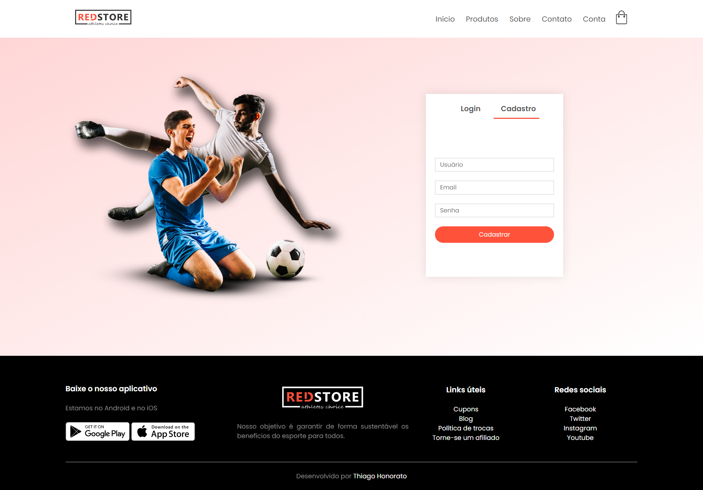

<h1 align="center"> E-Commerce website </h1>

E-Commerce website é um projeto desenvolvido com HTML, CSS e JavaScript, com base nos ensinamentos da série de vídeos "How To Make Ecommerce Website Using HTML And CSS Step By Step" [Parte 1 - Create e-Commerce Website](https://youtu.be/yQimoqo0-7g), [Parte 2 - Online Shopping Website Design](https://youtu.be/ZbnvP_hmxfE), [Parte 3 - Product Details Page](https://youtu.be/ENyk_W-Eleo), [Parte 4 - Shopping Cart Page](https://youtu.be/oXrlgOEiy6o), [Parte 5 - Login & Registration Page](https://youtu.be/vOXGuNVRGpA) do canal [@EasyTutorialsVideo](https://www.youtube.com/@EasyTutorialsVideo) no Youtube. 

 

  <a href="#-tecnologias">🚀 Tecnologias</a>&nbsp;&nbsp;&nbsp;|&nbsp;&nbsp;&nbsp;
  <a href="#-projeto">💻 Projeto</a>&nbsp;&nbsp;&nbsp;|&nbsp;&nbsp;&nbsp;
  <a href="#-layout">🔖 Layout</a>&nbsp;&nbsp;&nbsp;|&nbsp;&nbsp;&nbsp;
  <a href="#memo-licença">:memo: Licença</a>

 

  
  
  
  
  

 

## 🚀 Tecnologias

Esse projeto foi desenvolvido com as seguintes tecnologias:

 

## 💻 Projeto

O projeto é um e-commerce de uma loja de esportes, com página inicial, carrinho de compras, página com detalhes dos produtos, página com todos os produtos, página para registro e login.

 

## 🔖 Layout

Você pode navegar pelo projeto através [DESSE LINK](https://thiagomonts.github.io/red-store/).

 

## :memo: Licença

Esse projeto está sob a licença MIT.

 

---

Desenvolvido por [Thiago Honorato](https://www.linkedin.com/in/honoratothiago/)
